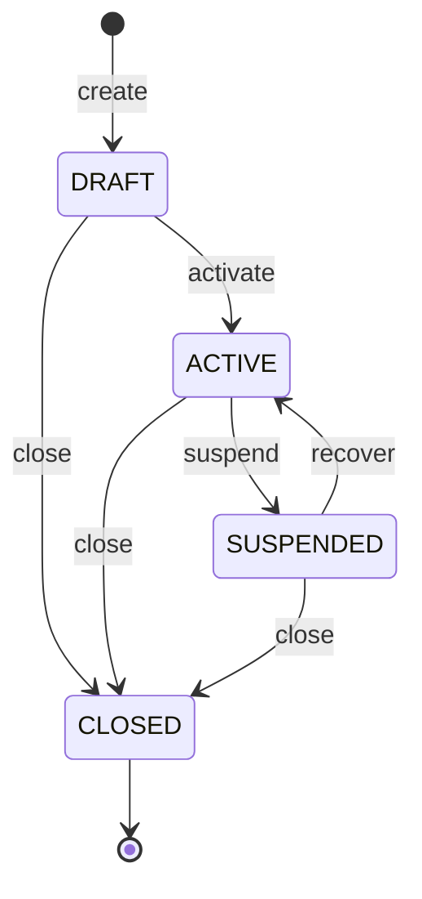
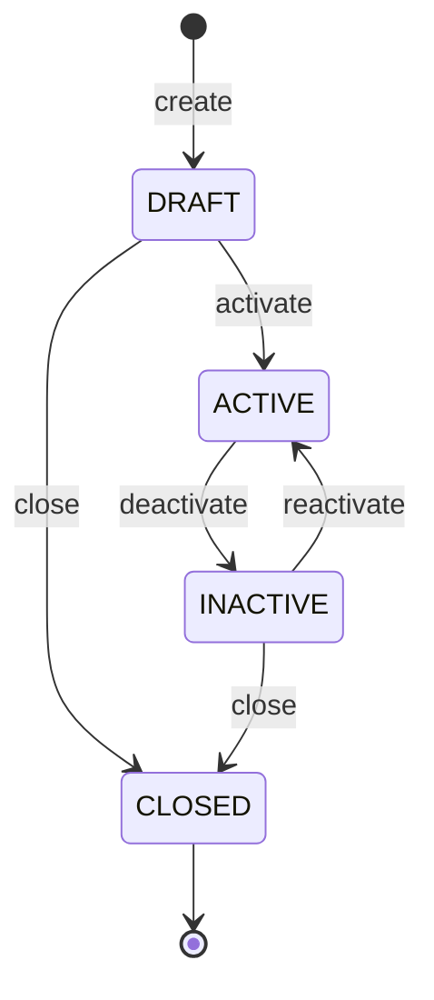

# Platform lifecycle state machines (SP001-SP003)

Every transition below is asserted by a *specific* function for that exact
prior status (`platform/tenancy/src/status.ts`,
`platform/organization/src/status.ts`) - there is no generic "is this status
reachable from anywhere" check. A rejected transition throws
`StateTransitionConflictError`, mapped by `apps/api`'s exception filter to
HTTP 409 with code `STATE_TRANSITION_CONFLICT`.

## Organization (SP001)

- Closure is terminal and never physically deletes the row - verified by
  `tests/integration/organization-domain.integration.test.ts`'s "closure
  preserves the row" test.
- Display-metadata updates (`updateOrganizationDisplayMetadata`) are allowed
  from any non-`CLOSED` status.
- `activate` and `recover` both land on `ACTIVE` but are distinct commands
  with distinct authorization/audit semantics (`organization.activate` vs
  `organization.recover` audit actions) - they are not one generic
  "set status" mutation.

## Company (SP002) and OperatingUnit (SP003)

Both entities share one state-machine shape (`SharedLifecycleStatus` in
`platform/organization/src/status.ts`):

Note the deliberate asymmetry with Organization: **`ACTIVE -> CLOSED` is not
allowed directly** for a company or operating unit - it must be deactivated
first. An organization's `close` command, by contrast, accepts `ACTIVE`
directly (closing a whole tenant is a single guarded operation; closing one
company inside a still-open organization is not - forcing an explicit
deactivate step first is intentional friction against accidentally closing
an entity still in active use).

## Creation-time parent guard (not a state-machine transition)

`loadOrganizationAcceptingNewCompanies` blocks *creating* a company or
operating unit when the parent organization is `SUSPENDED` or `CLOSED` - see
[organization-tenancy-model.md](organization-tenancy-model.md). This is a
precondition on the create command, not a transition on the child entity's
own state machine, and it is checked and rejected (`DomainValidationError`,
HTTP 400) *before* an Idempotency-Key is ever claimed.

## Operating-unit hierarchy is not a status concern

An operating unit's `parentOperatingUnitId` must reference a unit in the
same company and organization, and must not create a cycle -
`platform.enforce_operating_unit_consistency()` (a `BEFORE INSERT OR UPDATE`
trigger, `database/migrations/platform/0003_create_operating_units.sql`)
enforces both at the database layer regardless of which application code
path writes the row. See
`tests/integration/company-operating-unit-domain.integration.test.ts`'s
"rejects an operating unit whose parent belongs to a different company"
test.
